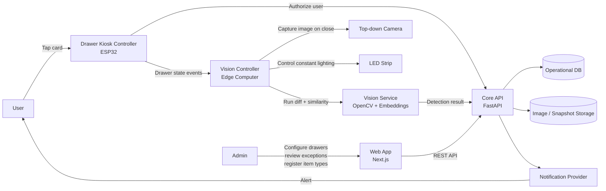
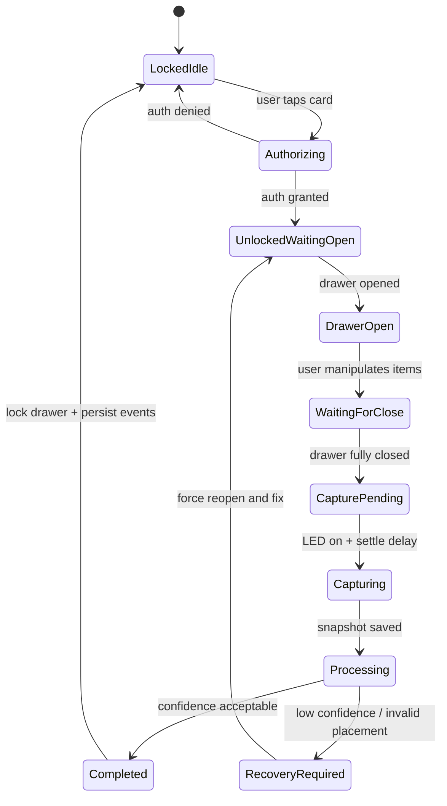
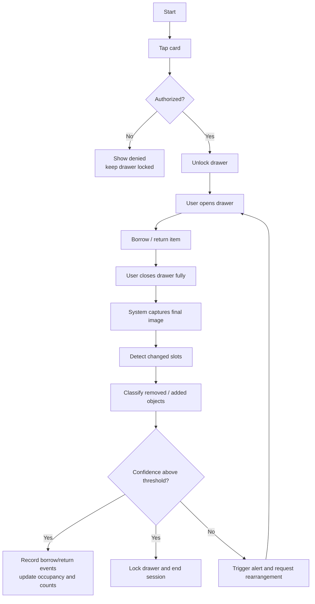
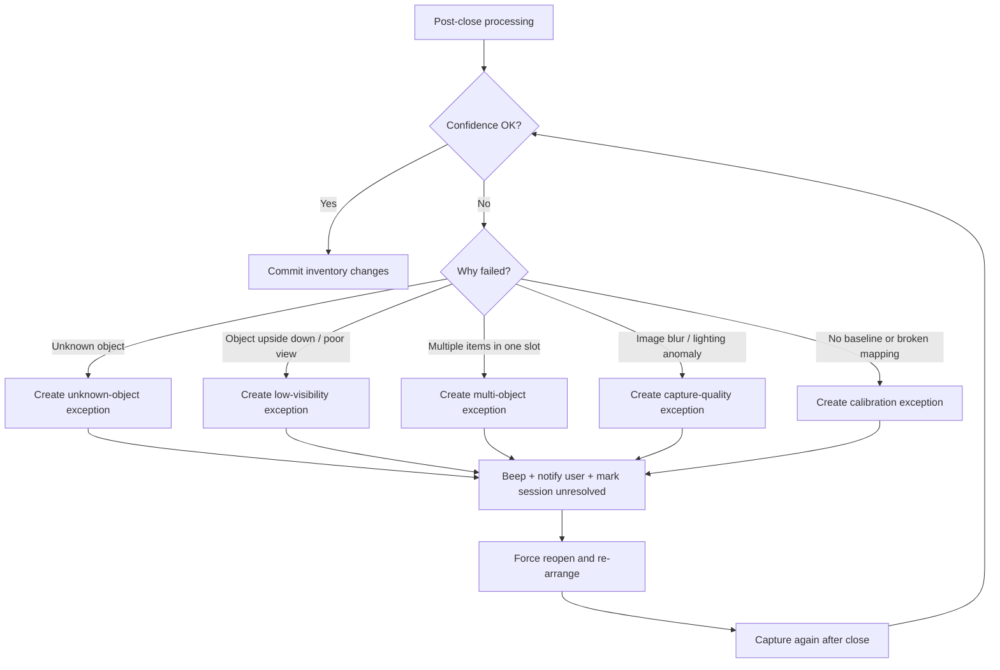
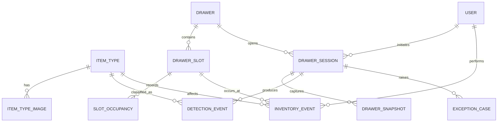

# Vision-Based Inventory Architecture

## Purpose

เอกสารนี้กำหนดภาพรวมสถาปัตยกรรมสำหรับระบบคลังอุปกรณ์แบบใหม่ โดยเปลี่ยนแนวคิดจาก `RFID per item` ไปเป็น `slot-based loose tracking` สำหรับลิ้นชักหลายชั้นที่มีกล้องมองจากด้านบน

เป้าหมายของเอกสารนี้คือให้ทีมเห็นภาพตรงกันก่อนเริ่มแก้ `backend`, `frontend`, `kiosk firmware`, และ `vision service`

---

## 1. Architecture Decision Summary

### Current model
- ผู้ใช้ยืนยันตัวด้วย NFC/RFID card
- อุปกรณ์แต่ละชิ้นต้องมี RFID tag ของตัวเอง
- ระบบบันทึกการยืม-คืนตาม `item_uid` รายชิ้น
- Kiosk ส่ง transaction เมื่อมีการสแกน item tag

### Target model
- ผู้ใช้ยังคงยืนยันตัวด้วยบัตรก่อนเปิดลิ้นชัก
- อุปกรณ์ในลิ้นชักไม่จำเป็นต้องมี RFID tag รายชิ้น
- ภายในลิ้นชักแบ่งเป็น grid แบบ `1 slot = 1 item`
- กล้องจะจับภาพและประมวลผลเฉพาะตอนลิ้นชักปิดสนิท
- ระบบติดตามแบบ `loose tracking` โดยเน้นชนิดอุปกรณ์และจำนวนคงเหลือ ไม่ติดตาม serial รายตัว
- การยืม/คืนจะถูกสรุปจากการเปลี่ยนแปลงของภาพระดับ slot

### Why this change
- ลดภาระการติด RFID ให้ทุกชิ้น
- รองรับการคืนของคนละช่องได้
- เหมาะกับชิ้นส่วนที่คล้ายกันและไม่จำเป็นต้องตาม serial number
- ใช้ข้อได้เปรียบจากสภาพแวดล้อมที่ควบคุมได้: top-down camera, fixed LED lighting, acrylic grid

---

## 2. Scope and Non-Goals

### In scope
- User authentication ก่อนปลดล็อกลิ้นชัก
- Drawer session lifecycle
- Slot-based occupancy tracking
- Image similarity สำหรับแนะนำชนิดอุปกรณ์และแยกชนิดตอนยืม-คืน
- Exception handling เมื่อความมั่นใจต่ำหรือจัดวางผิดเงื่อนไข
- Admin visibility สำหรับ layout, occupancy, snapshots, exceptions

### Out of scope for initial rollout
- การติดตาม serial number รายชิ้น
- การรู้ว่าผู้ใช้หยิบอุปกรณ์ตัวไหนจากล็อตเดียวกัน
- การนับ consumables รายชิ้นย่อย เช่น jumper wire ทีละเส้น
- Real-time video tracking ตอนลิ้นชักเปิดอยู่

---

## 3. System Context Diagram

### Component roles
- `ESP32 kiosk controller`: อ่านบัตร, คุม lock, อ่าน sensor ปิดสนิท, คุม buzzer/LED trigger event
- `Vision controller`: เครื่อง edge ที่รับ trigger, เปิดไฟ, หน่วงให้ภาพนิ่ง, ถ่ายภาพ, เรียก vision pipeline
- `Vision service`: background subtraction, slot comparison, crop changed slot, similarity matching, confidence scoring
- `Core API`: session, inventory events, occupancy map, exception workflow, admin APIs
- `Web app`: dashboard ผู้ดูแล, registration UI, exception review UI

---

## 4. Physical and Hardware Assumptions

### Drawer assumptions
- ลิ้นชักแต่ละชั้นแยกพื้นที่มองเห็นออกจากกัน
- แต่ละลิ้นชักมีกล้อง top-down ของตัวเอง
- ถ่ายภาพเฉพาะเมื่อ sensor ยืนยันว่า `drawer fully closed`
- มี delay หลังปิด เช่น 300-800 ms เพื่อรอแรงสั่นหยุด

### Optical assumptions
- ทุกลิ้นชักมี LED strip แสงขาวที่ความสว่างคงที่
- ใช้ acrylic grid ใสเพื่อลดการกลิ้งและลดเงาทึบ
- ต้องมีมุมกล้อง fixed และผ่านขั้นตอน calibration ก่อนใช้งาน

### Policy assumptions
- 1 slot ต่อ 1 อุปกรณ์เท่านั้น
- ผู้ใช้วางคืนช่องว่างไหนก็ได้
- Consumables ชิ้นเล็กให้จัดเป็นแพ็กหรือ non-tracked bin

---

## 5. Drawer Lifecycle

### Lifecycle notes
- ระบบจะไม่สรุปผลตอนลิ้นชักเปิดอยู่
- Session จะถือว่าเสร็จเมื่อวิเคราะห์ภาพหลังปิดแล้วผ่านเกณฑ์เท่านั้น
- ถ้าระบบไม่มั่นใจ จะไม่ปิด session แบบสำเร็จ และต้องเข้าสู่ recovery flow

---

## 6. User Flow

### User-facing rules
- ต้องแตะบัตรก่อนทุกครั้ง
- ยืมแล้วคืนช่องเดิมหรือช่องว่างอื่นก็ได้
- ห้ามวางซ้อนกัน
- ห้ามวางของแปลกปลอมในช่อง tracked
- ถ้าระบบเตือน ผู้ใช้ต้องเปิดลิ้นชักและจัดใหม่จนอ่านได้

---

## 7. Exception Flow

### Exception policy
- ถ้า confidence ต่ำกว่าค่า threshold ระบบต้องไม่บันทึก event แบบมั่นใจผิด
- Session จะถูก mark เป็น `attention_required` หรือ `manual_review_required`
- ต้องมี snapshot และ crop ที่เป็นหลักฐานให้ admin ตรวจย้อนหลังได้

---

## 8. Processing Pipeline

### A. Item type registration flow
1. Admin ถ่ายภาพอุปกรณ์เดี่ยวภายใต้แสงมาตรฐาน
2. ระบบสร้าง embedding จากภาพ
3. เปรียบเทียบกับ gallery ของ item types เดิม
4. ถ้าคล้ายชนิดเดิมเกิน threshold ให้เสนอ recommended match
5. ถ้า admin ยืนยัน ให้เพิ่มภาพเข้า gallery ของชนิดนั้น
6. ถ้า admin ปฏิเสธ ให้สร้าง `new item type`

### B. Borrow / return flow
1. เปิด session จากผู้ใช้ที่ยืนยันตัวแล้ว
2. ผู้ใช้เปิดลิ้นชัก หยิบ/คืนของ
3. เมื่อลิ้นชักปิดสนิท ระบบเปิดไฟและถ่ายภาพใหม่
4. เปรียบเทียบกับ baseline snapshot ก่อนหน้า
5. หาว่า slot ไหนเปลี่ยนบ้าง
6. crop เฉพาะ slot ที่เปลี่ยน
7. classify ว่าเป็น object ชนิดใด หรือเป็น unknown
8. translate ผลลัพธ์เป็น business events เช่น `borrow`, `return`, `adjustment`
9. update occupancy map และ inventory counts
10. set baseline ใหม่เป็น snapshot ล่าสุดที่ผ่านการยืนยันแล้ว

---

## 9. Data Model Draft

### Draft entities

#### `item_types`
เก็บชนิดอุปกรณ์ที่ระบบรู้จัก
- `id`
- `code`
- `name`
- `category`
- `description`
- `tracking_mode` เช่น `loose`, `bulk`, `non_tracked`
- `is_active`

#### `item_type_images`
เก็บ reference images สำหรับ similarity gallery
- `id`
- `item_type_id`
- `image_url`
- `embedding_vector_ref`
- `is_primary`
- `captured_view`

#### `drawers`
เก็บข้อมูลลิ้นชักแต่ละชุด
- `id`
- `drawer_code`
- `cabinet_code`
- `floor`
- `camera_id`
- `status`
- `slot_rows`
- `slot_cols`

#### `drawer_slots`
เก็บช่องใน grid ของแต่ละลิ้นชัก
- `id`
- `drawer_id`
- `slot_code`
- `row_index`
- `col_index`
- `polygon_json`
- `is_active`

#### `drawer_sessions`
เก็บ session การใช้งานของผู้ใช้
- `id`
- `drawer_id`
- `user_uid`
- `started_at`
- `closed_at`
- `status` เช่น `open`, `processing`, `completed`, `attention_required`
- `close_attempt_count`

#### `drawer_snapshots`
เก็บ snapshot ก่อนและหลังปิดลิ้นชัก
- `id`
- `drawer_id`
- `session_id`
- `snapshot_type` เช่น `baseline`, `post_close`, `retry`
- `image_url`
- `captured_at`
- `lighting_profile`
- `camera_profile`

#### `slot_occupancies`
เก็บสถานะล่าสุดของแต่ละ slot
- `id`
- `slot_id`
- `snapshot_id`
- `state` เช่น `empty`, `occupied`, `unknown`, `error`
- `item_type_id`
- `confidence`

#### `detection_events`
เก็บผล diff/classification ต่อ slot
- `id`
- `session_id`
- `slot_id`
- `change_type` เช่น `added`, `removed`, `changed`, `unchanged`
- `predicted_item_type_id`
- `similarity_score`
- `mask_area`
- `crop_image_url`

#### `inventory_events`
แปลงผล vision เป็นธุรกิจจริง
- `id`
- `session_id`
- `user_uid`
- `event_type` เช่น `borrow`, `return`, `adjustment`, `manual_resolution`
- `item_type_id`
- `quantity`
- `slot_id`
- `created_at`

#### `exception_cases`
เก็บเคสที่ระบบต้องให้ผู้ใช้หรือ admin แก้
- `id`
- `session_id`
- `slot_id`
- `exception_type`
- `severity`
- `status` เช่น `open`, `resolved`, `dismissed`
- `message`
- `evidence_image_url`

### Relationship rules
- หนึ่ง `drawer` มีหลาย `drawer_slots`
- หนึ่ง `drawer_session` มีหลาย `drawer_snapshots` และ `detection_events`
- หนึ่ง `slot` มี occupancy ล่าสุดได้หนึ่งสถานะ ณ เวลาใดเวลาหนึ่ง
- `inventory_events` เป็นแหล่งข้อมูลที่ใช้สรุปการยืม-คืนระดับธุรกิจ
- `item_uid` รายชิ้นยังอาจถูกเก็บไว้เพื่อ backward compatibility แต่ไม่ใช่แกนหลักของระบบใหม่

---

## 10. Baseline and Source of Truth

### Source of truth by layer
- `drawer_snapshots`: หลักฐานภาพดิบ
- `detection_events`: หลักฐานการตีความของ vision pipeline
- `inventory_events`: ความจริงเชิงธุรกิจว่าเกิดการยืมหรือคืนอะไร
- `slot_occupancies`: current state ของลิ้นชักแต่ละช่อง
- `item_types`: ความจริงเรื่อง taxonomy ของอุปกรณ์

### Baseline policy
- baseline ใหม่จะอัปเดตได้เฉพาะเมื่อ session ปิดแบบสำเร็จ
- ถ้า session ยัง unresolved ห้ามใช้ snapshot ล่าสุดไปแทน baseline เดิม
- ทุก retry ต้องผูกกับ session เดิมเพื่อ trace ย้อนหลังได้

---

## 11. Quality Gates

ระบบถือว่าประมวลผลผ่านได้เมื่อครบทุกข้อ
- drawer ปิดสนิทจริง
- snapshot ถ่ายภายใต้ lighting profile มาตรฐาน
- grid calibration ยัง valid
- slot changes ถูกตรวจพบโดยไม่มี ambiguity สำคัญ
- similarity score เกิน threshold ที่กำหนด
- ไม่พบ multi-object หรือ unknown object ใน tracked slot

ถ้าไม่ผ่านแม้แต่ข้อเดียว ให้เข้ากระบวนการ exception flow

---

## 12. Migration Strategy from Current System

### Keep in phase 1
- user auth ด้วยบัตร
- cabinet unlock flow
- audit logging
- admin dashboard พื้นฐาน
- image upload infrastructure

### Replace gradually
- จาก `item_uid` รายชิ้น ไปสู่ `item_type + slot + quantity`
- จาก `scan item tag` ไปสู่ `detect slot change`
- จาก `compartment as locker` ไปสู่ `drawer + grid slots`

### Compatibility note
ระยะเปลี่ยนผ่านควรเก็บ endpoint เดิมไว้ และเพิ่ม endpoint ใหม่สำหรับ vision workflow เพื่อให้ทีมสามารถทดสอบของใหม่โดยไม่ทำลาย flow เดิมทันที

---

## 13. Open Decisions

ประเด็นที่ต้องสรุปก่อนเริ่ม implementation จริง
- ใช้ edge device ตัวใดสำหรับ vision: Raspberry Pi 5, Jetson Orin Nano, หรือ mini PC
- ใช้ framework inference แบบใด: `PyTorch`, `ONNX Runtime`, หรือ `TensorRT`
- ใช้ notification provider อะไรสำหรับ alert ผู้ใช้
- threshold ความมั่นใจขั้นต่ำเท่าไรต่อ item type
- จะรองรับการ resolve exception โดย user อย่างเดียว หรือให้ admin override ได้ด้วย

---

## 14. Definition of Done for Architecture Phase

Architecture phase นี้ถือว่าเสร็จเมื่อทีมเห็นตรงกันว่า
- ระบบใหม่ใช้ `slot-based loose tracking` เป็นแกนหลัก
- จุดตัดความรับผิดชอบของ `ESP32`, `vision controller`, `vision service`, `core API`, `web app` ชัดเจน
- drawer lifecycle และ exception flow ชัดเจน
- data model draft เพียงพอสำหรับเริ่มทำ database schema และ APIs ใน commit ถัดไป
