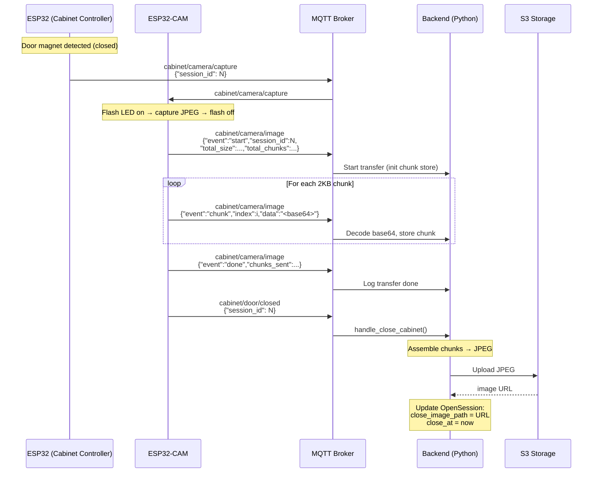

# Cabinet Door-Close & Image Capture Flow

## Overview

When the cabinet door closes, the ESP32 controller triggers the ESP32-CAM to capture a photo of the cabinet contents. The image is sent to the backend via MQTT in chunks, then the door-closed event is published so the backend can assemble and store the image.

## Sequence Diagram

## MQTT Topics

| Topic                              | Direction         | Payload Type | Description                        |
| ---------------------------------- | ----------------- | ------------ | ---------------------------------- |
| `cabinet/camera/capture`           | ESP32 → ESP32-CAM | JSON         | Trigger camera capture             |
| `cabinet/camera/image`             | ESP32-CAM → Backend | JSON       | All image events (start/chunk/done)|
| `cabinet/door/closed`              | ESP32-CAM → Backend | JSON       | Door closed (after image transfer) |

## Component Details

### ESP32 (Cabinet Controller) — `cabinet_firmware.ino`
- Detects door close via magnetic contact switch (LOW = closed)
- Publishes `cabinet/camera/capture` with `session_id`
- Does **NOT** publish `door/closed` directly — delegates to ESP32-CAM

### ESP32-CAM — `cabinet_camera/cabinet_camera.ino`
- Subscribes to `cabinet/camera/capture`
- Captures JPEG with flash LED illumination
- Sends image in 4KB chunks via MQTT
- Publishes `cabinet/door/closed` only after all chunks are sent successfully

### Backend — MQTT Handlers
- `camera_image.py` — handles `camera/image` (metadata) events
- `image_store.py` — thread-safe in-memory chunk collector
- `close_cabinet.py` — assembles image, uploads to S3, closes session

### Image Storage
- Images are uploaded to S3-compatible storage (Tigris)
- Path format: `cabinet-images/session_{id}_{uuid}.jpg`
- The S3 URL is stored in `OpenSession.close_image_path`
