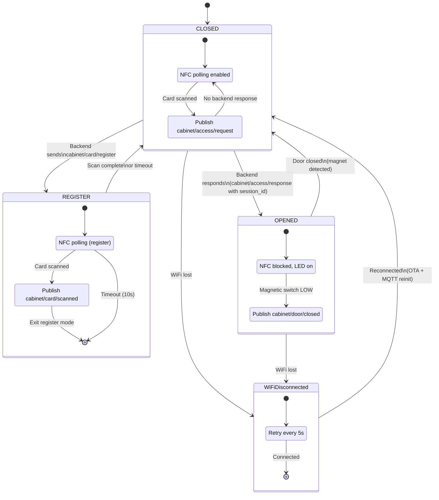

# ESP32 Cabinet Firmware — State Chart

```mermaid
stateDiagram-v2
    [*] --> CLOSED

    state CLOSED {
        [*] --> WaitForNFC
        WaitForNFC: NFC polling enabled
        WaitForNFC --> ScanDetected: Card scanned
        ScanDetected: Publish cabinet/access/request
        ScanDetected --> WaitForNFC: No backend response
    }

    state REGISTER {
        [*] --> WaitRegisterScan
        WaitRegisterScan: NFC polling (register)
        WaitRegisterScan --> CardScanned: Card scanned
        CardScanned: Publish cabinet/card/scanned
        CardScanned --> [*]: Exit register mode
        WaitRegisterScan --> [*]: Timeout (10s)
    }

    state OPENED {
        [*] --> DoorOpen
        DoorOpen: NFC blocked, LED on
        DoorOpen --> DoorClosed: Magnetic switch LOW
        DoorClosed: Publish cabinet/door/closed
    }

    CLOSED --> OPENED: Backend responds\n(cabinet/access/response with session_id)
    CLOSED --> REGISTER: Backend sends\ncabinet/card/register
    REGISTER --> CLOSED: Scan complete\nor timeout
    OPENED --> CLOSED: Door closed\n(magnet detected)

    state WiFiDisconnected {
        [*] --> Retrying
        Retrying: Retry every 5s
        Retrying --> [*]: Connected
    }

    CLOSED --> WiFiDisconnected: WiFi lost
    OPENED --> WiFiDisconnected: WiFi lost
    WiFiDisconnected --> CLOSED: Reconnected\n(OTA + MQTT reinit)
```
